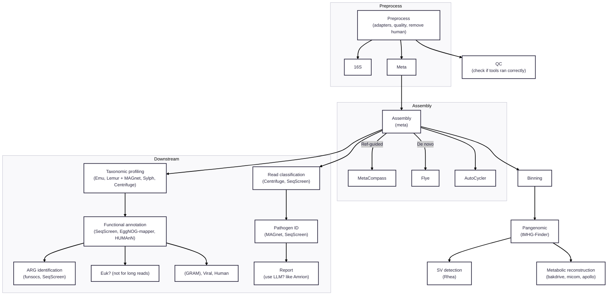

```mermaid
---
config:
      theme: redux
---
flowchart TD
 subgraph Preprocess["Preprocess"]
        preprocess["Preprocess<br>(adapters, quality, remove human)"]
        fastq_16S["16S"]
        fastq_meta["Meta"]
  end
 subgraph Assembly["Assembly"]
        asm["Assembly<br>(meta)"]
        metacomp["MetaCompass"]
        flye["Flye"]
        autocycler["AutoCycler"]
  end
 subgraph Downstream["Downstream"]
        task["Taxonomic profiling<br>(Emu, Lemur + MAGnet, Sylph, Centrifuge)"]
        annotation["Functional annotation<br>(SeqScreen, EggNOG-mapper, HUMAnN)"]
        ARG["ARG identification<br>(funsocs, SeqScreen)"]
        eukaryote["Euk? (not for long reads)"]
        gramviral["(GRAM), Viral, Human"]
        classification["Read classification<br>(Centrifuge, SeqScreen)"]
        pathogen["Pathogen ID<br>(MAGnet, SeqScreen)"]
        report["Report<br>(use LLM? like Amrion)"]
  end
    preprocess --> fastq_16S & fastq_meta & QC["QC<br>(check if tools ran correctly)"]
    fastq_meta --> asm
    asm -- "Ref-guided" --> metacomp
    asm -- De novo --> flye
    asm --> autocycler & binning["Binning"] & task & classification
    binning --> pangenomic["Pangenomic<br>(tMHG-Finder)"]
    pangenomic --> SV["SV detection<br>(Rhea)"] & metabolic["Metabolic reconstruction<br>(bakdrive, micom, apollo)"]
    task --> annotation
    annotation --> ARG & eukaryote & gramviral
    classification --> pathogen
    pathogen --> report
    
```

