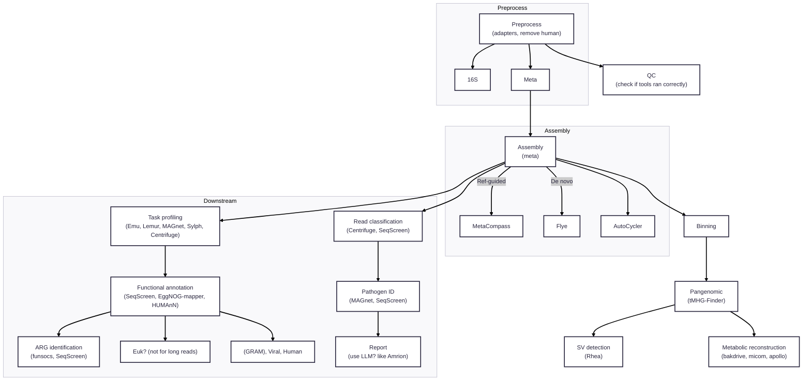

```mermaid
---
config:
      theme: redux
---
flowchart TD

subgraph Preprocess
    preprocess["Preprocess<br>(adapters, remove human)"]
    preprocess --> fastq_16S[16S]
    preprocess --> fastq_meta[Meta]
end

subgraph Assembly
    fastq_meta --> asm["Assembly<br>(meta)"]
    asm -->|Ref-guided| metacomp[MetaCompass]
    asm -->|De novo| flye[Flye]
    asm --> autocycler[AutoCycler]
end

asm --> binning[Binning]
binning --> pangenomic["Pangenomic<br>(tMHG-Finder)"]
pangenomic --> SV["SV detection<br>(Rhea)"]
pangenomic --> metabolic["Metabolic reconstruction<br>(bakdrive, micom, apollo)"]

subgraph Downstream
    asm --> task["Task profiling<br>(Emu, Lemur, MAGnet, Sylph, Centrifuge)"]
    task --> annotation["Functional annotation<br>(SeqScreen, EggNOG-mapper, HUMAnN)"]
    annotation --> ARG["ARG identification<br>(funsocs, SeqScreen)"]
    annotation --> eukaryote["Euk? (not for long reads)"]
    annotation --> gramviral["(GRAM), Viral, Human"]

    asm --> classification["Read classification<br>(Centrifuge, SeqScreen)"]
    classification --> pathogen["Pathogen ID<br>(MAGnet, SeqScreen)"]

    pathogen --> report["Report<br>(use LLM? like Amrion)"]
end

preprocess --> QC["QC<br>(check if tools ran correctly)"]
```

